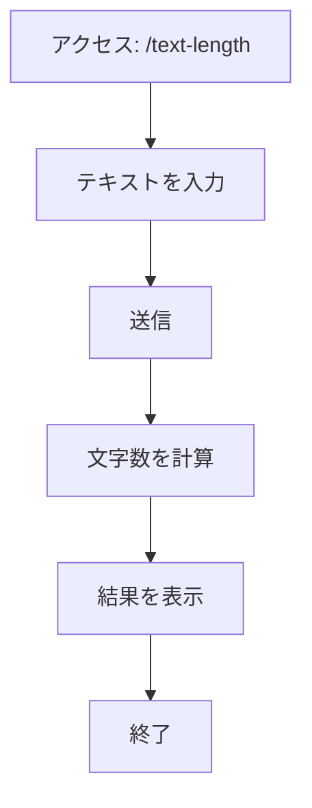
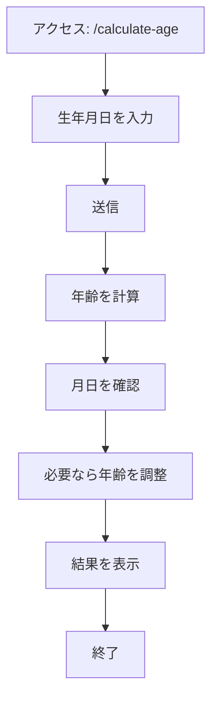
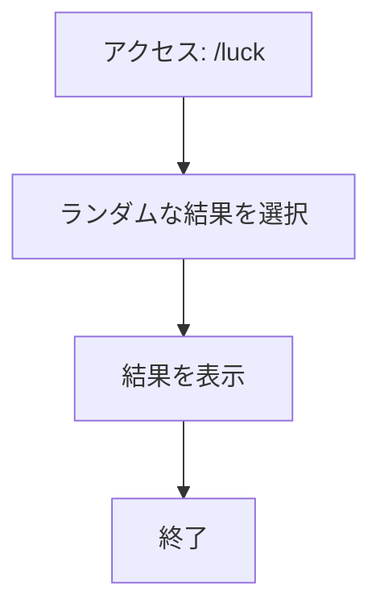
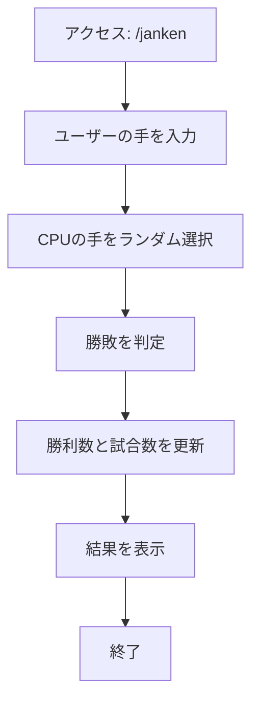
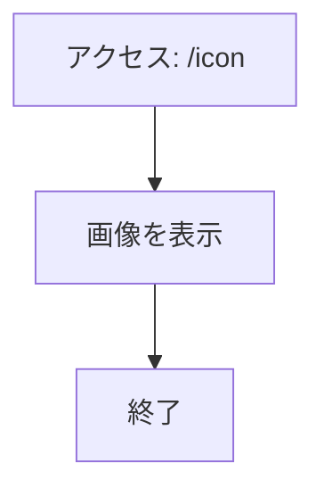
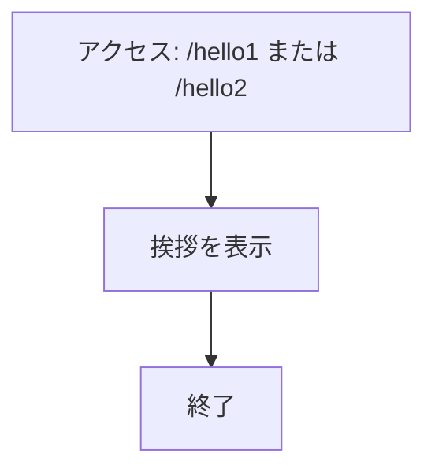

# webpro_06

## このプログラムについて
このプログラムは、Node.js と Express を使用して構築された簡易的なWebサーバーである．ユーザーの入力に基づいたさまざまな機能を提供する．

- テキストの長さを計算
- 年齢を計算
- おみくじを引く
- ジャンケンをする
- アイコンを表示
- 多言語の挨拶を表示

---

## ファイル一覧
| ファイル名                   | 説明                       |
|------------------------------|----------------------------|
| `app5.js`                   | プログラム本体             |
| `views/text-length.ejs`      | テキスト長さ計算ページ     |
| `views/calculate-age.ejs`    | 年齢計算ページ             |
| `views/luck.ejs`             | おみくじ結果ページ         |
| `views/janken.ejs`           | ジャンケンの結果ページ     |
| `public/styles.css`          | デザイン用CSS             |
| `views/icon.ejs`             | アイコンを表示するページ   |
| `views/show.ejs`             | 多言語の挨拶を表示するページ |

---
## 機能の説明
### 1. テキストの長さを計算
- **URL**: [`http://localhost:8080/text-length?text=へんてこりん`](http://localhost:8080/text-length?text=%E3%81%B8%E3%82%93%E3%81%A6%E3%81%93%E3%82%8A%E3%82%93)
- **概要**: 入力されたテキストの文字数を計算する．
- **使用手順**:
  1. ブラウザで上記のURLにアクセス．
  2. URLのクエリパラメータとして、`text` に任意の文字列を指定する（例: `へんてこりん`）．
  3. 入力された文字列の長さが計算され、結果が表示されます．

---

### 2. 年齢を計算
- **URL**:  [`http://localhost:8080/calculate-age?birthYear=2005-11-19`](http://localhost:8080/calculate-age?birthYear=2005-11-19)
- **概要**: 入力された生年月日を基に現在の年齢を計算し，結果を表示します．
- **使用手順**:
  1. 上記のURLにアクセスする．
  2. クエリパラメータ `birthYear` に生年月日を指定する（例: `2005-11-19`）．
  3. 現在の日付を基に計算された年齢が表示される．

---

### 3. おみくじ
- **URL**:  [`http://localhost:8080/luck`](http://localhost:8080/luck)
- **概要**: ランダムにおみくじの結果を表示する（例: 大吉、中吉）．
- **使用手順**:
  1. 上記のURLにアクセスする．
  2. サーバーがランダムに結果を選択し，画面に結果が表示される．

---

### 4. ジャンケン
- **URL**: [`http://localhost:8080/janken?hand=グー&win=0&total=3`](http://localhost:8080/janken?hand=%E3%82%B0%E3%83%BC&win=0&total=3)
- **概要**: ユーザーとコンピュータがジャンケンを行い、勝敗を判定して結果を表示します。累計勝利数や試合数も追跡します。
- **使用手順**:
  1. 上記のURLにアクセスします。
  2. クエリパラメータで以下を指定します：
     - `hand`：ユーザーの手（例: グー、チョキ、パー）。
     - `win`：これまでの勝利数（例: 0）。
     - `total`：これまでの試合数（例: 3）。
  3. コンピュータの手と勝敗が判定され、試合数や勝利数が更新されます。

---

### 5. アイコン表示
- **URL**: [`http://localhost:8080/icon`](http://localhost:8080/icon)
- **概要**: 指定されたアイコン画像をブラウザ上に表示する．
- **使用手順**:
  1. 上記のURLにアクセスする．
  2. サーバー側で設定されたアイコン画像（例: Appleロゴ）が画面に表示される．

---

### 6. 多言語の挨拶
- **URL**:　[`http://localhost:8080/hello1`](http://localhost:8080/hello1)  ，[`http://localhost:8080/hello2`](http://localhost:8080/hello2)
- **概要**: 英語とフランス語の挨拶を表示する．
- **使用手順**:
  1. `/hello1` または `/hello2` にアクセス．
  2. 英語とフランス語の挨拶「Hello world」，「Bon jour」が表示される．

---

